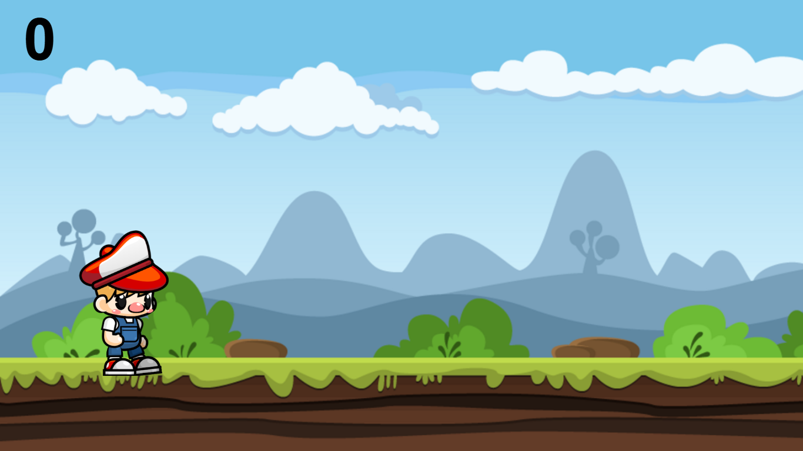

# 2D Running Game 🏃‍♂️💨

A **2D Running Game** is a fast-paced side-scroller where your character dashes forward, avoiding obstacles and collecting power-ups 🏃‍♂️💨. With simple controls, this game offers endless fun and excitement! 🚀🎮

## Technologies Used 🛠️
- **HTML** 🌐
- **CSS** 🎨
- **JavaScript** 💻
- **VS Code** 🖥️

## Features ✨
- Side-scrolling action ⬅️➡️
- Character movement and obstacle dodging 🏃‍♂️💨
- Power-ups collection 💡
- Simple and fun gameplay 🎮

## Screenshot 📸

🌍 Live Demo: 

## How to Play 🎮
1. Use the arrow keys (or predefined keys) to move your character ⬆️⬇️⬅️➡️.
2. Dodge obstacles and collect power-ups to boost your score! 🚧💎
3. Try to go as far as you can without hitting any obstacles! 🏁

Enjoy the game! 🎉
